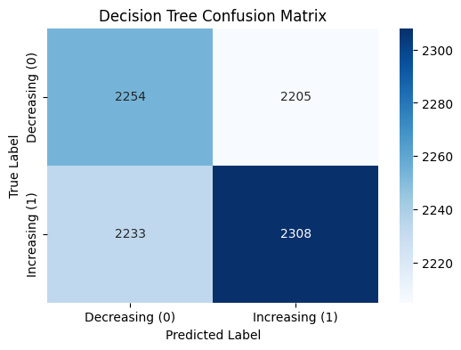
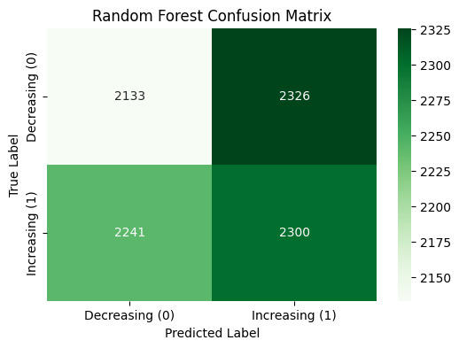
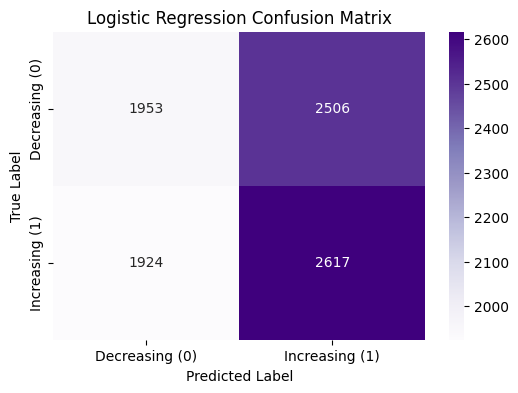
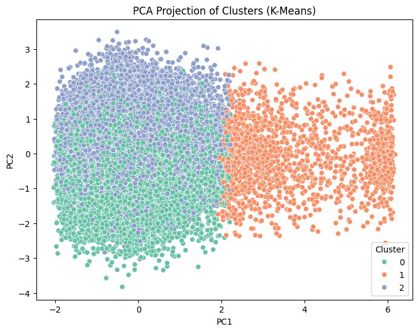

# AI Job Market Analysis (2024–2030)

A critical machine learning analysis exploring whether AI-related features can predict future job growth or decline using a synthetic job-market dataset.

This project focuses not only on model building, but on diagnosing why machine learning models fail when the underlying data lacks real predictive signal.

---

## 📌 Project Objective

The goal of this project was to determine:

- Can we predict whether a job will **increase or decrease** between 2024–2030?
- Do features such as salary, automation risk, AI impact level, or education explain job trends?
- If supervised models fail, does the dataset contain natural clusters?

---

## 📊 Dataset

- Source: Kaggle – *AI Impact on Job Market (2024–2030)*
- ~30,000 job records
- Features include:
  - Salary
  - Automation Risk
  - Experience Required
  - AI Impact Level
  - Remote Work Ratio
  - Projected Openings (2024 & 2030)

⚠️ Important Finding:  
Many numeric variables show **extremely narrow variance** and synthetic patterns, limiting predictive potential.

---

## ⚙️ Modeling Approach

### Supervised Learning Models
- Decision Tree
- Random Forest
- Logistic Regression

All models were trained using a 70/30 train-test split.  
Scaling was applied where appropriate.

---

## 📉 Model Results

All supervised models performed at approximately **0.50 accuracy and ROC-AUC**, equivalent to random guessing.

### Decision Tree

### Random Forest

### Logistic Regression

The confusion matrices show nearly symmetric classification behavior, indicating no meaningful separation between Increasing and Decreasing jobs.

---

## 🧪 Experiments Conducted

1. **Removing Percent_Change feature**
2. **Winsorizing extreme outliers**
3. **K-Means Clustering**

None of these approaches improved predictive performance.

---

## 🔍 Unsupervised Analysis (K-Means)

To test whether natural structure existed in the dataset, K-Means clustering was applied.

The PCA projection shows heavy overlap between clusters, confirming weak internal structure and lack of meaningful differentiation.

---

## 📌 Key Findings

- The dataset lacks real predictive signal.
- Most numeric variables exhibit artificial uniformity.
- Supervised models cannot extract patterns where none exist.
- Model complexity does not compensate for poor data quality.
- Clustering confirms the absence of meaningful structure.

This project reinforced a critical data science principle:

> Machine learning cannot produce meaningful predictions when the underlying data does not reflect real-world variance.

---

## 🛠️ Tech Stack

- Python
- Pandas
- NumPy
- Scikit-learn
- Matplotlib / Seaborn
- PCA & K-Means

---

## 📄 Full Report

For detailed methodology, experiments, and analysis:

[View Full Project Report (PDF)](futureJobs.pdf)

---

## 💡 What This Project Demonstrates

- End-to-end ML workflow
- Data cleaning & feature engineering
- Supervised & unsupervised learning
- Experimental design
- Model evaluation & ROC analysis
- Data quality diagnosis
- Critical thinking in ML failure analysis

---

## 📬 Author

Maya Tem  
M.S. Data Science  
Tennessee State University
